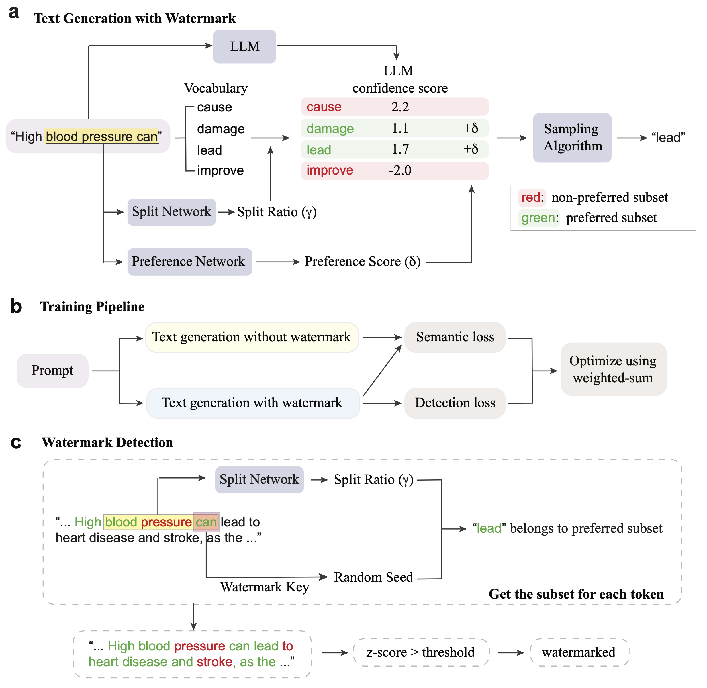

# Medical Watermark

This repository contains the code for our paper on **Medical Watermark**.

## Introduction

We introduce a novel watermarking method for medical large language models (LLMs), focusing on two primary objectives: 

- **Detectability**: Measured by the z-score.
- **Semantic Coherence**: Assessed by the cosine similarity between the embeddings of watermarked and non-watermarked texts.

These metrics are controlled by two hyperparameters: the split ratio ($\gamma$) and watermark logit ($\delta$). These values are adjusted for different tokens to account for their unique characteristics.

To determine token-specific values for $\gamma$ and $\delta$, we use two lightweight networks: the $\gamma$-generator ($G_\gamma$) and the $\delta$-generator ($G_\delta$). Below is an overview of our proposed training method:



## Environment Setup

```
conda create --name medmark python=3.10  
conda activate medmark
pip install -r requirements.txt
```

## Data and ckpt
Download data and ckpt from [here](https://drive.google.com/file/d/17cTwmAqXWezvhVu2yyf3InXbl55sMuhN/view?usp=sharing), then unzip it and put `data` and `ckpt` in this folder.

## Training

To train the network, run the following command:
```
bash train_mistral.sh
```
Default batch size is 8, which takes ~42GB GPU memory.

## Evaluation

### Default Settings

- **LLM**: `mistralai/Mistral-7B-Instruct-v0.2`
- **Semantic Similarity**: `Salesforce/SFR-Embedding-2_R`
- **Sampling**: Multinomial sampling with temperature=0.5, 1.0, top_k=50
- **Dataset**: Train: [HealthSearchQA](https://huggingface.co/datasets/katielink/healthsearchqa). Test: HealthSearchQA, [Open-i](https://openi.nlm.nih.gov/), [ClinicalNotesQA](https://huggingface.co/datasets/starmpcc/Asclepius-Synthetic-Clinical-Notes)
- **Sample Generation**: 500 samples.
- **Batch Size**: Default is 20, requiring ~30GB of GPU memory for Mistral-7B model.

To modify default settings, check the `config` folder.

### Running Evaluation

`eval_paper` folder contains the results.
You can also evaluate by yourself using the following command, and the generated results are stored in the `eval` folder by default. 

```
CUDA_VISIBLE_DEVICES=0 python wm_health.py --config_file config/MedMark.yaml
```

Here is the command to compute the detection threshold based on 10k unwatermarked text from [PubMedQA](https://huggingface.co/datasets/qiaojin/PubMedQA), with FPR = 0.1% or 1%.
```
CUDA_VISIBLE_DEVICES=0 python wm_FPR.py --config_file config/MedMark.yaml
```


<!-- ## Citation

If you use this work in your research or applications, please cite it as follows:
```
@article{huo2024token,
  title={Token-Specific Watermarking with Enhanced Detectability and Semantic Coherence for Large Language Models},
  author={Huo, Mingjia and Somayajula, Sai Ashish and Liang, Youwei and Zhang, Ruisi and Koushanfar, Farinaz and Xie, Pengtao},
  journal={arXiv preprint arXiv:2402.18059},
  year={2024}
}
``` -->
